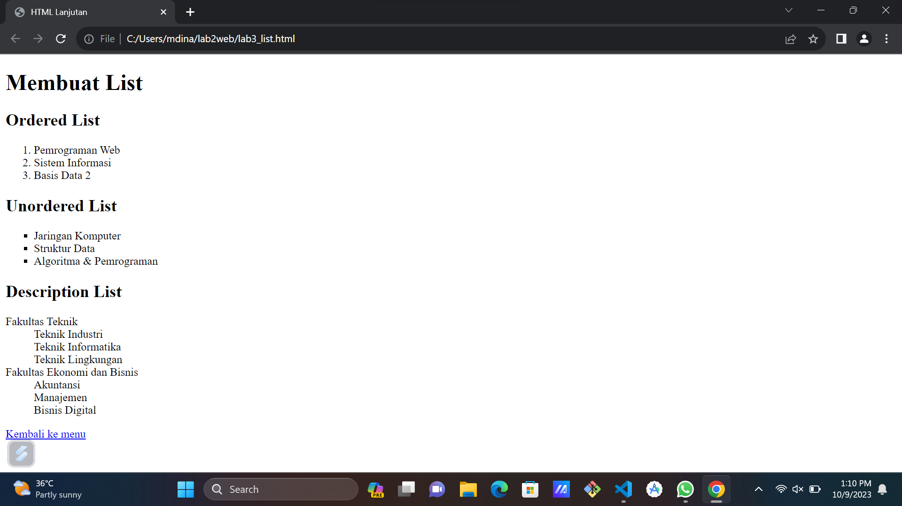
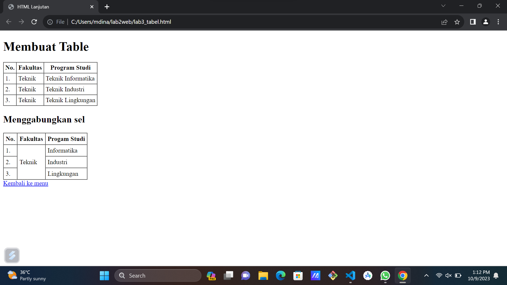
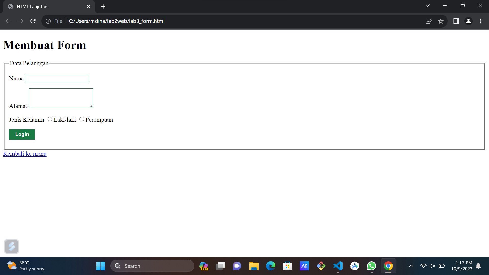
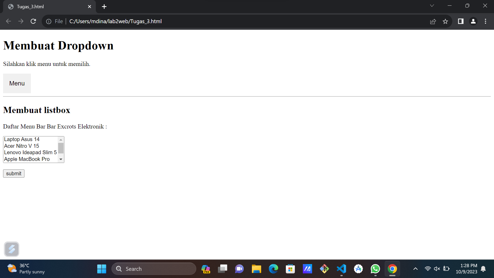

# Lab3web
# Nama : Muhammad Din Al Ayubi
# Kelas : TI22A3
# NIM : 312210293

## Modul Praktikum Pemrograman Web
* Setiap elemen atau field form harus memiliki atribut name. Atribut name merupakan nama dari field yang akan menjadi kunci dan variabel di dalam program. Sedangkan atribut id, sifatnya opsional.
* Instruksi Praktikum
1. Persiapkan text editor misalnya VSCode.
2. Buat folder baru dengan nama Lab3Web
3. Ikuti langkah-langkah praktikum yang akan dijelaskan berikutnya.
4. Lakukan validasi dokumen html dengan mengakses http://validator.w3.org
* Langkah-langkah Praktikum
* Persiapan membuat dokumen HTML dengan nama file ```lab3_list.html``` seperti berikut.
```python
<!DOCTYPE html>
<html lang="en">
    <head>
        <meta charset="UTF-8">
        <meta name="viewport" content="width=device-width, initial-scale=1.0"> <title>HTML Lanjutan</title>
    </head>
    <body>
        <header>
            <h1>Membuat List</h1>
        </header>
    </body>
</html>
```
## Membuat Ordered List
* Kemudian tambahkan kode untuk membuat Ordered List seperti berikut.
```python
<sectionid="order-list">
    <h2>Ordered List</h2>
    <ol>
        <li>Pemrograman Web</li>
        <li>Sistem Informasi</li>
        <li>Basis Data 2</li>
    </ol>
</sectionid>
```
## Membuat Unorderd List
* Kemudian tambakan kode untuk membuat Unordered List, setelah deklarasi ordered list pada section unordered-list, seperti berikut.
```python
<section id="unorder-list">
    <h2>Unordered List</h2>
    <ul type="square">
        <li>Jaringan Komputer</li>
        <li>Struktur Data</li>
        <li>Algoritma &amp; Pemrograman</li>
    </ultype>
</section>
```
## Membuat Description List
* Kemudian tambahkan kode untuk membuat description list setelah deklarasi unorderd-list.
```python
<section id="unorder-list">
    <h2>Description List</h2>
    <dl>
        <dt>Fakultas Teknik</dt> <dd>Teknik Industri</dd>
        <dd>Teknik Informatika</dd>
        <dd>Teknik Lingkungan</dd>
        <dt>Fakultas Ekonomi dan Bisnis</dt>
        <dd>Akuntansi</dd>
        <dd>Manajemen</dd>
        <dd>Bisnis Digital</dd>
    </dl>
</section>
</body>
</html>
```
## Hasil Output

## Membuat Tabel
* Buat file baru dengan nama ```lab3_tabel.html``` seperti berikut.
```python
!DOCTYPE html>
<html lang="en">
    <head>
        <meta charset="UTF-8">
        <met aname="viewport" content="width=device-width, initial-scale=1.0">
        <title>HTML Lanjutan</title>
    </head>
    <body>
        <header>
            <h1>Membuat Table</h1>
        </header>
    </body>
</html lang>
```
* Kemudian selanjutnya tambahkan kode untuk membuat tabel sederhana seperti berikut:
```python
<table border="1" cellpadding="4" cellspacing="0">
    <thead>
        <tr>
            <th>No.</th>
            <th>Fakultas</th>
            <th>Program Studi</th>
        </tr>
    </thead>
    <tbody>
        <tr>
            <td>1.</td>
            <td>Teknik</td>
            <td>Teknik Informatika</td>
        </tr>
        <tr>
            <td>2.</td>
            <td>Teknik</td>
            <td>Teknik Industri</td>
        </tr>
        <tr>
            <td>3.</td>
            <td>Teknik</td>
            <td>Teknik Lingkungan</td>
        </tr>
    </tbody>
    </table>
```
## Mengatur Margin dan Padding
* Untuk mengatur margin dan padding pada cel data, tambahkan atribut cellpadding dan cellspacing pada tag table.
```python
<table border="1" cellpadding="4" cellspacing="0">
```
## Menggabungkan Sel Data
* Untuk menggabungkan sel data, gunakan atribut rowspan dan colspan. Atribut rowspan untuk menggabungkan baris (secara vertikal) dan colspan untuk menggabungkan kolom (secara horizontal).
```python
 <h2>Menggabungkan sel</h2>
    <table border="1" cellpadding="5" cellspacing="0">
        <thread>
        <tr>
        <th>No.</th>
        <th>Fakultas</th>
        <th>Progam Studi</th>
        </tr>
        </thread>
        <tbody>
        <tr>
        <td>1.</td>
        <td rowspan="3">Teknik</td>
        <td>Informatika</td>
        </tr>
        <tr>
        <td>2.</td>
        <td>Industri</td>
        <tr>
            <td>3.</td>
            <td>Lingkungan</td>
        </tr>
        </tbody>
        </table>
    </body>
</html>
```
## Hasil Output

## Membuat Form
* Buat file baru dengan nama ```lab3_form.html``` seperti berikut.
```python
<!DOCTYPE html>
<html lang="en">
    <head>
        <style>
            form p > label {
                display: inline-block;
                widht: 100px;
            }
            form input[type="text"], form textarea {
                border: 1px solid #197a43;
            } 
            form input[type="submit"] {
                border: 1px solid #197a43;
                background-color: #197a43;
                color: #ffff;
                font-weight: bold;
                padding: 5px 15px;
            }
        </style>
        <meta charset="UTF-8">
        <meta name="viewport" content="widht-device-widht, initial-scale=1.0">
        <title>HTML Lanjutan</title>
    </head>
    <body>
        <header>
            <h1>Membuat Form</h1>
        </header>
    </body>
</html>
<form action="proses.php" method="post">
    <fieldset>
        <legend>Data Pelanggan</legend>
    <p>
        <label for="nama">Nama</label>
        <input type="text" id="nama"name="nama">
    </p>
    <p>
        <label for="alamat">Alamat</label>
        <textarea id="alamat" name="alamat" cols="20" rows="3"></textarea>
    </p>
    <p>
        <label>Jenis Kelamin</label>
        <input id="jk_1" type="radio" name="kelamin" value="L"/><label for="jk_1">Laki-laki</label>
        <input id="jk_p" type="radio" name="kelamin" value="p"/><label for="jk_p">Perempuan</label>
    </p>
    <p><input type="submit" value="Login"></p>
    </fieldset>
    </form>
    <a href="Tugas_3.html">Kembali ke menu</a>
    </body>
</html>
```
## Hasil Output

## Tugas menampilkan ```dropdown menu dan listbox``` dengan multiple selection.
```python
<!DOCTYPE html>
<html>
    <head>
        <meta name="viewport" content="width=device-widht, initial-scale=1">
        <style>
            .dropbtn {
                background-color: Irgb(58, 241, 226);
                color: rgb(10, 3, 3);
                padding: 16px;
                font-size: 16px;
                border: none;
                cursor: pointer;
            }
            .dropbtn:hover, .dopbtn:focus { 
                background-color: rgb(57, 14, 248); 
            }.
            dropdown {
                position: relative;
                display: inline-block;
            }
            .dropdown-content {
                display: none;
                position: absolute;
                min-widht: 160px;
                background-color: rgb(255, 0, 0);
                box-shadow: 0px 8px 16px 0px rgba(23, 189, 201, 8.2);
                overflow: auto;
            }
            .dropdown-content a {
                color: rgb(1, 2, 0);
                padding: 12px 16px;
                text-decoration: none;
                display: block;
            }
            .dropdown a:hover {background-color: rgb(31, 244, 252);}
            .show {display: block;}
        </style>
    </head>
    <body>
        <h1>Membuat Dropdown</h1>
        <p>Silahkan klik menu untuk memilih.</p>
        <div class="dropdown">
            <button onclick="myFunction()" class="dropbtn">Menu</button>
            <div id="myDropdown" class="dropdown-content">
            <a href="lab3_list.html">Membuat List</a>
            <a href="lab3_tabel.html">Membuat Tabel</a>
            <a href="lab3_form.html">Membuat Form</a>
        </div>
    </div>
        <script>
        /* When the user clicks on the button,
        toggle between hiding and showing the dropdown content */
        function myFunction() {
            document.getElementById("myDropdown").classList.toggle("show");
        }
        // Close the dropdown if the user clicks outside of it
        widow.onclick = function(event) {
            if (!event.target.matches('.dropbtn')) {
                var dropdowns = document.getElementsByClassName("dropdown-content");
                var i;
                for (i=0; i < dropdowns.length; i++) { 
                    var openDropdown = dropdowns[i];
                    if (openDropdown.classList.contains('show')) { 
                        openDropdown.classList.remove('show');
                    }
                    }
                }
            }
        </script>
        <hr>
        <form>
            <h2>Membuat listbox</h2>
            <p>Daftar Menu Bar Bar Excrots Elektronik :</p>
            <select name="menu" size="4">
                <option value="1">Laptop Asus 14</option>
                <option value="1">Acer Nitro V 15</option>
                <option value="1">Lenovo Ideapad Slim 5</option>
                <option value="1">Apple MacBook Pro</option>
                <option value="1">Hp ProBook 430 G8</option>
            </select>
            <p><input type="submit" value="submit" /></p>
        </form>
    </body>
    <head>
        <!-- menyisipkan css eksternal -->
        <link rel="stylesheet" href="style_eksternal.css" type="text/css">
    </head>
</html>
```
## Hasil Output
